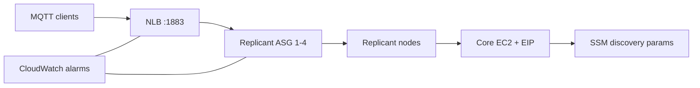
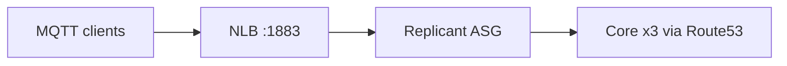

# EMQX on AWS — Architecture

## Root stack (primary)

Single core EC2 + ASG replicants behind an internet-facing NLB on **MQTT :1883**.

- Core is **not** in the NLB target group (dashboard on `:18083`).
- EMQX 5.8 OSS: all nodes are peer cluster members (no Enterprise `node.role`).
- Replicants join using SSM-published cluster seeds from the core.

## Modular stack (`terraform/`)

Optional layout: **3 core** nodes in private subnets, Route53 zone `emqx.internal`, replicants in private subnets. Same NLB + autoscaling pattern; apply from `terraform/` directory.

