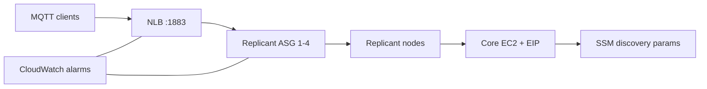
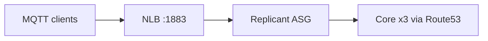

# EMQX on AWS — Architecture

## Root stack (primary)

**Core ASG** (1–2 nodes, CPU autoscaling) + **replicant ASG** (1–4 nodes, NLB/network/CPU autoscaling) behind an internet-facing NLB on **MQTT :1883**. Primary core holds the Elastic IP for the dashboard.



- Core is **not** in the NLB target group (dashboard on `:18083`).
- EMQX 5.8 OSS: all nodes are peer cluster members (no Enterprise `node.role`).
- Replicants join using SSM-published cluster seeds from the core.

## Security

| Port | Endpoint | Exposure |
|------|----------|----------|
| 1883 | NLB → replicants | Public MQTT (plaintext) |
| 8883 | NLB → replicants | Public MQTT over TLS (optional; ACM terminates at NLB) |
| 18083 | Core EIP only | Dashboard; restricted by `dashboard_allowed_cidr` |

Security groups ensure brokers accept MQTT **only from the NLB**, not directly from the internet. TLS uses **AWS ACM** on the NLB `:8883` listener; backends stay on `:1883`.

MQTT clients use **username/password** authentication (`built_in_database` backend) when `emqx_mqtt_enable_authn=true` (default). Validate with `validate_authentication.ps1`.

Full details: [security-validation.md](security-validation.md), [authentication-validation.md](authentication-validation.md). Run:

```bash
pwsh -File ./scripts/validate_security.ps1
```

## Modular stack (`terraform/`)

Optional layout: **3 core** nodes in private subnets, Route53 zone `emqx.internal`, replicants in private subnets. Same NLB + autoscaling pattern; apply from `terraform/` directory.


