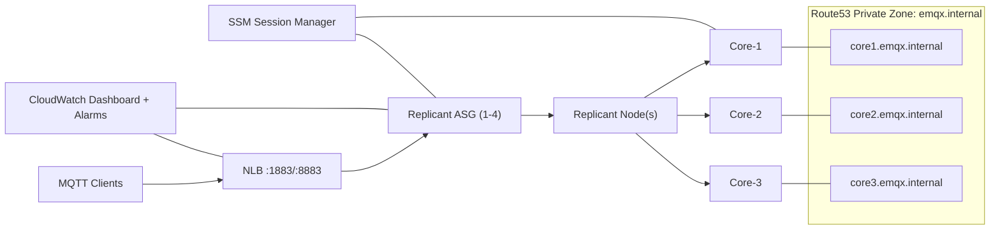

# EMQX on AWS - Architecture

## Mermaid Diagram

## Design Notes

- Core nodes are fixed and never auto-scaled.
- Replicant nodes are auto-scaled for client-facing MQTT load.
- NLB only forwards traffic to replicants.
- Route53 private DNS provides stable cluster seed discovery.
- SSM is enabled for SSH-less operations while SSH is also available for interview troubleshooting.
