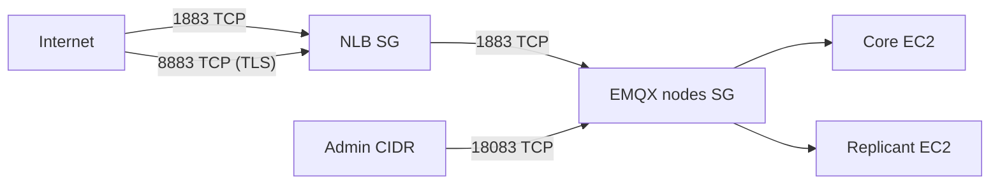

# Security Validation

This document describes how the EMQX AWS stack enforces network security, which ports are allowed, how MQTT over TLS works, and how to run automated security validation.

## Security groups

Two security groups protect the stack:

| Security group | Attached to | Purpose |
|----------------|-------------|---------|
| `{project}-nlb-sg` | Network Load Balancer | Public MQTT ingress only |
| `{project}-emqx-cluster-sg` | Core + replicant EC2 | Broker and dashboard; MQTT only from NLB |



### Allowed ports

| Port | Protocol | Where | Source | Purpose |
|------|----------|-------|--------|---------|
| **1883** | TCP | NLB | `0.0.0.0/0` (internet) | MQTT plaintext for clients |
| **8883** | TCP | NLB | `0.0.0.0/0` (internet) | MQTT over TLS (when enabled) |
| **18083** | TCP | Core EC2 only | `dashboard_allowed_cidr` | EMQX dashboard (not on NLB) |
| **1883** | TCP | Replicant EC2 | NLB security group only | Backend MQTT from load balancer |
| **22** | TCP | EC2 | `ssh_allowed_cidr` | SSH troubleshooting (optional) |
| **\* ** | All | EC2 (self) | Same security group | EMQX cluster Erlang distribution |

**Not allowed (by design):**

- Port **18083** on the NLB — dashboard is never exposed through the load balancer.
- Port **1883** on EC2 from the public internet — clients must connect via the NLB.
- Port **8883** on EC2 — TLS terminates at the NLB; brokers continue to listen on **1883** internally.

Terraform definitions: `security.tf` (root stack) or `terraform/modules/security-groups/` (modular stack).

## MQTT over TLS

When `enable_mqtt_tls = true` in `terraform.tfvars`:

1. Clients connect to `ssl://<NLB_DNS>:8883`.
2. The **NLB TLS listener** terminates TLS using an **ACM certificate**.
3. The NLB forwards decrypted MQTT traffic to replicants on **port 1883** (same target group as plaintext).
4. EMQX nodes do not need listener certificates — encryption ends at the load balancer edge.

This is the recommended AWS pattern for MQTT TLS with a Network Load Balancer: ACM-managed certificates, no private key distribution to EC2 instances.

### Enable TLS

1. Request a public certificate in **AWS Certificate Manager** (same region as the NLB, e.g. `ap-south-1`).
2. Validate domain ownership (DNS recommended).
3. Set in `terraform.tfvars`:

```hcl
enable_mqtt_tls     = true
acm_certificate_arn = "arn:aws:acm:ap-south-1:ACCOUNT:certificate/CERT-ID"
```

4. Apply:

```bash
terraform apply
```

5. Clients use:

```
ssl://<NLB_DNS>:8883
```

With a custom domain, point a CNAME to the NLB DNS name and pass `-TlsHostname your.mqtt.example.com` to the validation script for full certificate hostname verification.

## Certificate management

| Topic | Detail |
|-------|--------|
| **Issuer** | AWS Certificate Manager (ACM) |
| **Private key** | Stored and rotated by AWS; never on EC2 |
| **Renewal** | ACM auto-renews DNS-validated certificates before expiry |
| **Region** | Certificate must be in the **same region** as the NLB |
| **SSL policy** | `ELBSecurityPolicy-TLS13-1-2-2021-06` (configurable via `mqtt_tls_ssl_policy`) |
| **Rotation** | Issue a new ACM cert → update `acm_certificate_arn` → `terraform apply` (listener updates in place) |

## AWS ACM integration

| Component | ACM role |
|-----------|----------|
| NLB listener `:8883` | `certificate_arn` references ACM certificate |
| `acm.tf` | Data source reads certificate metadata when TLS is enabled |
| Terraform outputs | `acm_certificate_arn`, `mqtt_tls_broker_url`, `mqtt_tls_enabled` |
| Validation script | Describes ACM cert status (`ISSUED`), checks TLS handshake on `:8883` |

ACM does **not** terminate dashboard TLS in this stack — dashboard remains HTTP on `:18083` restricted by `dashboard_allowed_cidr`. For HTTPS dashboard, add an ALB or restrict dashboard CIDR to a VPN/office network.

## Production hardening checklist

- [ ] Set `dashboard_allowed_cidr` to your office/VPN CIDR (not `0.0.0.0/0`)
- [ ] Set `ssh_allowed_cidr` to your office/VPN CIDR
- [ ] Enable `enable_mqtt_tls` and use ACM for client connections
- [ ] Disable plaintext `:1883` at NLB SG if all clients use TLS (remove ingress rule or use separate stack)
- [ ] Use strong `emqx_dashboard_password` and `emqx_node_cookie`
- [ ] Run `validate_security.ps1` after every deploy

## Run security validation

After `terraform apply` and bootstrap:

```bash
pwsh -File ./scripts/validate_security.ps1
# or
bash ./scripts/validate_security.sh
```

With TLS and hostname verification:

```bash
pwsh -File ./scripts/validate_security.ps1 -TlsHostname mqtt.example.com
```

Expected final line:

```
=== SECURITY SUMMARY: ALL CHECKS PASSED ===
```

### What the script validates

| Check | Description |
|-------|-------------|
| NLB SG port 1883 | MQTT plaintext ingress present |
| NLB SG port 8883 | Present when TLS enabled; skipped when disabled |
| NLB SG port 18083 | Must **not** be exposed |
| EMQX nodes SG port 1883 | Only from NLB SG, not `0.0.0.0/0` |
| EMQX nodes SG port 18083 | Allowed for `dashboard_allowed_cidr` |
| EMQX nodes SG port 8883 | Must **not** be public on EC2 |
| Port reachability | TCP probes to NLB `:1883`, `:8883` (if TLS), core `:18083` |
| MQTT over TLS | TLS handshake, cert expiry, TLS 1.2+, ACM status `ISSUED` |
| Dashboard auth | Login API requires credentials (when password provided) |

## Terraform outputs

```bash
terraform output -raw nlb_security_group_id
terraform output -raw emqx_nodes_security_group_id
terraform output -raw mqtt_tls_enabled
terraform output -raw mqtt_tls_broker_url
terraform output -raw acm_certificate_arn
```

## Related docs

- [architecture.md](architecture.md) — cluster layout
- [COMMANDS-REFERENCE.txt](COMMANDS-REFERENCE.txt) — Section L (security validation commands)
- [PROOF-CHECKLIST.md](PROOF-CHECKLIST.md) — submission checklist
